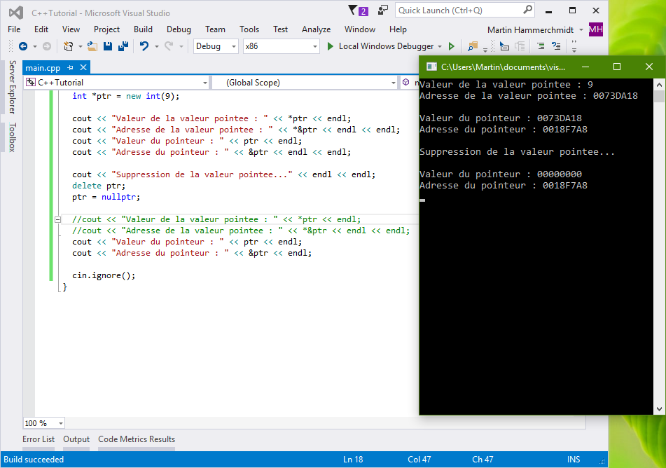

### Les pointeurs

Autant en C que en C++, les pointeurs sont... mythiques.

Beaucoup prennent peur et s'enfuit lâchement à la vu des pointeurs. Mais, la vérité sur les pointeur c'est qu'il faut bien les comprendre. Une fois assimilé et compris, vous verrez c'est ultra-simple.

#### Les allocations mémoires

##### Le principe

On pourrais confondre les pointeurs avec les références. En effet, ils permettent tous les deux d'accéder à une donnée qu'il ne possèdent pas.

Mais, leur fonctionnement est complètement différent. Avec les variables normales et les références, nous ne contrôlons pas nous même la mémoire. En effet, vous créez une variable normale et votre logiciel alloue une zone de la mémoire automatiquement pour vous. Si votre variable est détruite, alors la zone de la mémoire allouée l'est aussi instantanément.

Avec les pointeurs vous contrôlez vous même la mémoire. Et toute la difficulté est là ! Si vous allouez de la mémoire mais que vous oubliez de la libérer, vous aurez alors une fuite de mémoire.

Les fuites de mémoires sont mortelles ! Imaginez un logiciel qui consomme 4 Gb de mémoire vive alors qu'en réalité il n'en utilise que 200 Mb. Pourquoi ? Parceque il a alloué de la mémoire mais a oublié de la libérer. Vous comprendrez mieux après.

#### La pratique

En pratique un pointeur est une variable à part entière. Plus en détail, c'est un nombre. Et ce nombre représente une adresse mémoire.

Je m'explique. Comme nous l'avons vu dans le chapitre précédent, toute donnée dans la mémoire vive a une adresse qui lui est propre. Un pointeur enregistre donc cette adresse pour que vous puissiez y accéder. Il **pointe** donc sur la donnée.

Voici un code d'exemple ainsi que son résultat.

    int *ptr = new int(9);

    cout << "Valeur de la valeur pointee : " << *ptr << endl;
    cout << "Adresse de la valeur pointee : " << *&ptr << endl << endl;
    cout << "Valeur du pointeur : " << ptr << endl;
    cout << "Adresse du pointeur : " << &ptr << endl << endl;

    cout << "Suppression de la valeur pointee..." << endl << endl;
    delete ptr;
    ptr = nullptr;

    //cout << "Valeur de la valeur pointee : " << *ptr << endl;
    //cout << "Adresse de la valeur pointee : " << *&ptr << endl << endl;
    cout << "Valeur du pointeur : " << ptr << endl;
    cout << "Adresse du pointeur : " << &ptr << endl;

    cin.ignore();



Il est très important de comprendre à la perfection ce que vous voyez ici. Premièrement, concentrons nous sur le code.

##### La création des pointeurs

Maintenant, il est temps pour vous d'apprendre à utiliser les pointeurs. Voici comment créer un pointeur :

    TYPE * NAME;
    
En C++, le symbole caractéristique du pointeur est une ```*```. A chaque fois que vous verrez une étoile en C++, c'est qu'un pointeur n'est pas très loin. Comme vous le savez, le pointeur est un *nombre* qui pointe sur une donnée. Donc comme toujours en C++, nous devons donner un type à cette donnée.

Vous savez que les pointeurs permettent de gérer manuellement la mémoire. En fait c'est *faux*. Ce ne sont pas les pointeurs qui permettent de gérer la mémoire mais les opérateurs ```new``` et ```delete```. Comme leur nom l'indique, ```new``` permet de d'allouer de la mémoire alors que ```delete``` permet de la récupérer.

Voici comment allouer de la mémoire : 

    new TYPE;
    
Cela s'appelle l'allocation dynamique. L'opérateur ```new``` va donc allouer dans votre mémoire une zone pour le type ```TYPE``` que vous avez demandé. Et, cette instruction retourne l'adresse mémoire de l'allocation fraîchement effectuée. Or, comme vous le savez, un pointeur sauvegarde les adresses mémoires. Alors fusionnons les !

    TYPE * NAME = new TYPE;
    
Cette instruction va simplement allouer une zone mémoire du type ```TYPE```, et il assignera alors au pointeur ```NAME``` l'adresse de cette mémoire pour que vous puissiez l'utiliser. Si vous souhaitez, vous pouvez aussi assigner directement une valeur après l'initialisation :

    TYPE * NAME = new TYPE(VALUE);
    
Ainsi, voici un exemple en pratique (cf. le code au dessus)

    int *ptr = new int(9);
    
> **Danger** Attention ! Si vous initialisez un pointeur l'assigner (donc sans lui donner de valeur), vous faites erreur. Vous devez **toujours** assigner une valeur à votre pointeur. En effet, le pointeur risque de pointer sur une variable aléatoire sur votre ordinateur, et vous pourriez alors créer des instabilités sur votre système. Ainsi, si vous créez un pointeur que vous voulez laisser vide, faites comme suit : ```int *ptr = nullptr```. La constante ```nullptr``` provient du C++11 et est essentielle.
    
##### L'utilisation des pointeurs

Maintenant que nous avons notre pointeur, comment pouvons nous l'utiliser ? Rien de plus simple.

Pour accéder à la valeur que le pointeur pointe, utilisez l'opérateur ```*``` (oui encore).

Regardez plutôt :

    int *ptr = new int(9);
    int value = *ptr;
    
Alors, ```value``` vaudra ```9```. Par contre, si vous enlevez l'étoile, vous accéderez à l'adresse mémoire de la valeur pointée. Par exemple :

    int *ptr = new int(9);
    cout << *ptr << endl; // Affichera 9
    cout << ptr << endl; // Affichera l'adresse mémoire de la valeur pointée
    
