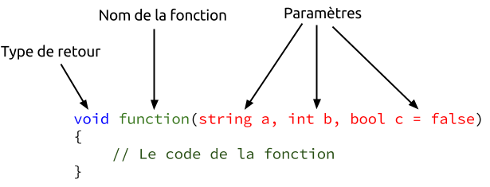

## Les fonctions

Les fonctions sont un autre élément majeur du C++. Jamais vous ne pourrez les
éviter alors il vaut mieux les maîtriser sur le bout des doigts ! Mais, comme
toujours, ne vous inquiétez pas. Les fonctions sont l'un des éléments du C++ les
plus simples à comprendre et à utiliser !

### A quoi sert une fonction ?

Il est impossible d'écrire tout son code dans la fonction ```main()``` car
parfois vous devrez effectuer la même action 100 fois, 200 fois voir beaucoup
plus ! De plus, la fonction pourrait faire plusieurs milliers de lignes de code,
ce qui serait tout simplement illisible.

Une fonction va vous permettre de "stocker" du code pour pouvoir le relancer
autant de fois que vous le souhaitez. Un peu comme une mallette que vous ouvrez
dès que vous le souhaitez !

### Comment fonctionne une fonction ?

C'est ici que les choses se compliquent. Pour créer une fonction, vous devez
appliquer sa syntaxe hors de la fonction ```main()```, avant la fonction 
```main()``` pour être plus précis.

Voici comment se structure sa syntaxe :



#### Le nom de la fonction

Le nom de la fonction est très important car c'est avec ce nom que nous allons
l'appeler. Par exemple, si vous nommez votre fonction ```openWindow```, dans
notre code nous pourrons l'appeler en écrivant l'instruction ```openWindow();```.
Choisissez le judicieusement, il doit représenter ce que fait la fonction !

#### Les paramètres

Parfois, dans la fonction, vous aurez besoin d'informations. Par exemple vous
créez une fonction ```sayHello``` qui dit bonjour à la personne désigné. Pour
désigner cette personne, la fonction doit connaitre son nom, et c'est ici que
les paramètres interviennent. Les paramètres sont des variables qui sont passées
dans la fonction et que la fonction peut utiliser, par exemple le nom d'une
personne.

Pour désigner les paramètres, vous devez écrire le type du paramètre ainsi que
son nom, ce qui aura pour effet de créer la variable correspondante
automatiquement. Vous pouvez demander autant de paramètres que vous voulez,
séparez-les simplement par des virgules. Par défaut, les paramètres sont
obligatoires, mais si vous voulez les rendre optionnels, vous devez simplement
les *initialiser* comme une variable en plaçant un ```=``` puis la valeur par
défaut.

#### Le type de retour

Une fois l'exécution de la fonction terminée, vous pouvez retourner à l'appelant
une valeur. Pour faire cela, vous devez spécifier le type de retour (```int```,
```double```, ```string```, ...). Ensuite, pour renvoyer la valeur acquise, vous
devez clôturer votre fonction avec l'instruction ```return [valeur à retourner];```.
Par exemple ```return 0;```. Attention, cette instruction terminera la fonction
en cours, même s'il reste du code à exécuter par la suite.

> **Hint** Si vous ne voulez rien retourner à l'appelant, spécifiez le type ```void``` qui signifie *vide* ou *rien* en anglais.

#### Des exemples !

Vous n'avez probablement pas pu assimiler tout ce que je viens de présenter, c'est
normal. Voici des exemples que je vous propose d'analyser et de lancer chez vous.

    #include <iostream>
    #include <string>
    
    using namespace std;
    
    void sayHello(string name)
    {
        cout << "Hello " << name << "!" << endl;
    }
    
    int main()
    {
        sayHello("Martin");
        sayHello("Benjamin");
        sayHello("Chuck Norris");
    }
    
Ce programme dira bonjour trois fois. Voici une variante avec les paramètres par
défaut :

    #include <iostream>
    #include <string>
    
    using namespace std;
    
    void sayHello(string name = "outsider")
    {
        cout << "Hello " << name << "!" << endl;
    }
    
    int main()
    {
        sayHello("Martin");
        sayHello("Benjamin");
        sayHello();
        sayHello("Chuck Norris");
    }

Et enfin, voici un exemple avec les types de retour :

    #include <iostream>
    
    using namespace std;
    
    int addition(int x, int y)
    {
        return x + y;
    }
    
    int subtraction(int x, int y)
    {
        int result = x - y;
        return result;
    }
    
    int main()
    {
        cout << "5 - 4 + 6 = ";
    
        int result = addition(subtraction(5, 4), 6);
        cout << result << endl;
    }
    
Bon, on est d'accord, ces programmes sont purement théoriques et n'ont absolument
aucune utilité. Je vous laisse comprendre par l'exemple.

### La fonction spéciale ```main()```

Cette fonction retourne un entier et ne prend pas de paramètres (enfin nous
verrons ce cas particulier plus tard). Cette fonction est spéciale car votre
OS l'appelle automatiquement quand vous voulez lancer votre programme C++.

> **Note** La fonction retourne un entier, mais par convention, on retourne 0 la plupart du temps, ou rien du tout ce qui n'est pas très correct en vérité. L'entier retourné permet à l'OS de savoir si l'application c'est bien déroulé ou non.

Nous étudierons cette fonction spéciale en long et en large plus tard.