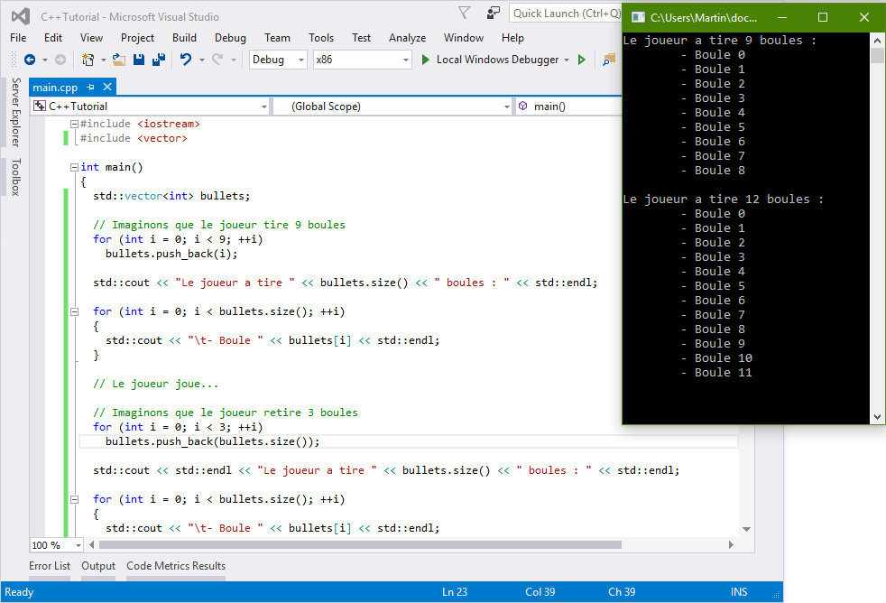

### Les tableaux dynamiques

Imaginez, vous êtes un développeur dans une jeune startup qui est en train de créer un jeu révolutionnaire. Dans ce jeu, vous contrôlez un personnage qui possède une seule et unique arme : un lanceur de boules.

Bien entendu, le joueur a la possibilité de tirer avec l'arme. Mais que ce passe t'il lorsque qu'il presse la détente ? Une boule est tirée. Bien entendu, chaque boule réagit à la physique et doit donc rester dans le monde virtuel.

Comment stocker les boules ? On ne peut pas utiliser un tableau statique car ceci ont une taille fixe hors notre joueur peut tirer autant de boules qu'il le souhaite. Il faut donc utiliser un tableau à taille variable. Ces tableaux sont des tableaux dynamiques.

Nous allons voir le tableau dynamique le plus simple, le ```vector```. Il en existe d'autres, que nous verront par la suite.

Le ```vector``` est très simple d'utilisation, voici un premier exemple déjà très complet :

    #include <iostream>
    #include <vector>

    int main()
    {
      std::vector<int> bullets; // La taille du tableau est 0
  
      // Imaginons que le joueur tire 9 boules
      for (int i = 0; i < 9; ++i)
        bullets.push_back(i);

      std::cout << "Le joueur a tire " << bullets.size() << " boules : " << std::endl;

      for (int i = 0; i < bullets.size(); ++i)
      {
        std::cout << "\t- Boule " << bullets[i] << std::endl;
      } // La taille du tableau est 9

      // Le joueur joue...

      // Imaginons que le joueur retire 3 boules
      for (int i = 0; i < 3; ++i)
        bullets.push_back(bullets.size());

      std::cout << std::endl << "Le joueur a tire " << bullets.size() << " boules : " << std::endl;

      for (int i = 0; i < bullets.size(); ++i)
      {
        std::cout << "\t- Boule " << bullets[i] << std::endl;
      } // La taille du tableau est 9 + 3 = 12
    }

Nous n'avons bien sur pas un jeu vidéo ici, mais c'est tout comme. Imaginez donc que le joueur joue et que à deux reprise il tire des boules. La première fois, il tire 9 boules, et la seconde fois il tire 3 boules.

Voici le résultat dans la console :


*Oui bon c'est vrai, j'ai changé d'OS et de logiciel. Mais chut :p*

J'en convient, il y a, ici, beaucoup de nouvelles choses. Mais ne vous inquiétez pas, rien d'insurmontable.

Premièrement, comme toujours, on inclus la fonction que l'on souhaite :

    #include <vector>
    
A partir de maintenant, je vais appeler le ```vector``` un vecteur.

La création et l'initialisation d'un vecteur est tout à fait similaire à un tableau statique en C++. Voici la syntaxe :

    vector<TYPE> NAME;
    
Contrairement à ce que nous avons vu jusqu'ici, pas besoin de spécifier de taille ! Et oui, ce tableau a une taille variable et est donc vide à la base il n'attend qu'à être rempli.

Entre les <>, vous devez insérer le type que contiendra le vecteur, et, pour rappel, il ne pourra enregistrer que ce type précis de données.