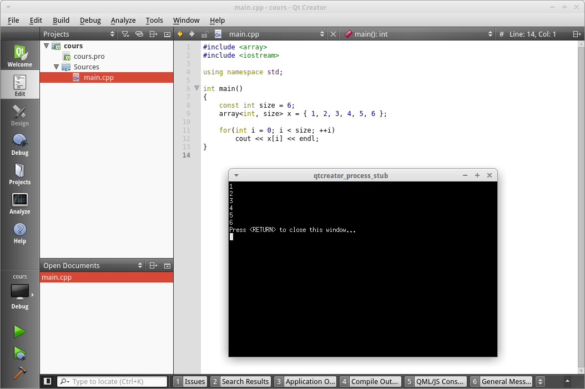

### Les tableau statiques en C++

#### C++11

Qu'est-ce que le C++11 ? Excellente question. Le C++ est un langage en constante évolution, et des *mises à jours* officielles sont à rythme régulier crées. La dernière mise à jour majeure est le C++11, sortie en 2011. La dernière mise à jour qui est mineur est le C++14, sortie en 2014. La prochaine grosse mise à jour qui apportera plein de nouveautés sortira en 2017 avec le C++17.

Le C++11 a apporté de très nombreuses choses, dont les ```array```. Le C++11, bien qu'assez ancien maintenant, n'est peut être pas sur votre machine si vous n'avais pas vos logiciels à jours. Si ce chapitre ne fonctionne pas chez vous, c'est que le C++11 n'est pas activé chez vous. Je vous laisse donc le soin de chercher sur Internet comment l'activer sur notre plateforme.

#### Les mêmes propriétés que les tableaux statiques du C

Les tableaux statiques du C++ proposent les même propriété que celle du C, avec des fonctionnalités en plus. Le nombre d'élément inclu au tableau est **fixe**, vous ne pourez pas rajouter ou supprimer un élément. Le type d'élément que contient le tableau est **fixe** lui aussi, si vous y mettez des ```int```, ce sera toujours des ```int```.

Les tableaux statiques du C++ s'utilisent de la même manière que ceux du C, mis à part les différences que nous allons étudier ici.

#### Comment les utiliser ?

Tout d'abords, nous devons incluer un nouveau fichier, le fichier **array**.

    #include <array>
    
Ensuite nous les utilisons comme suit :

    #include <array>
    #include <iostream>
    
    int main()
    {
        const int size = 6;
        array<int, size> x = { 1, 2, 3, 4, 5, 6 };
        
        for(int i = 0; i < size; ++i)
            cout << x[i] << endl;
    }
    
Ce qui affichera, vous l'aurez deviné : 



L'utilisation est la même que les tableaux en C. Par contre la création est différente, voici la syntaxe :

    array<TYPE, SIZE> NAME;
    
On déclare tout d'abord une variable de type ```array``` donc insère le mot clé ```array``` au début et le nom de la variable à la fin, normal. Par contre, grosse subtilité ici, voici une nouvelle syntaxe que nous étudierons en détail plus tard mais que nous utiliserons souvent.

Juste après ```array```, sans mettre d'espace vous devez ouvrir les chevrons et indiquer quel type le tableau contiendra puis quel sera sa taille. Le tout séparé par une virgule.

Ainsi cela nous donne par exemple :

    array<short, 5> x;
    
Cela permet au tableau de savoir ses deux paramètres immuables qu'on ne peux pas changer une fois qu'il est créé : sa taille et son type.

#### Les bonus de ce tableau

Oui, ce tableau nous offre des bonus, en plus des tableaux statiques du C. Le membre ```size()``` vous permet d'avoir la taille du tableau.

    array<int, 5> x = {};
    cout << x.size() << endl;
    
Ceci affichera 5, par exemple. De la même manière, ```front``` et ```back``` vous permettent d'accéder respectivement au premier et au dernier élement.

    array<int, 5> x = {};
    int first = x.front();
    int last = x.back();
    
Il existe d'autres choses comme ça, nous les verrons plus tard.

Mais ces tableaux ont un défaut, leur taille est fixe. Nous ne pouvons pas supprimer ou rajouter des éléments à la volé ce qui est un problème majeur tout de même. Donc après avoir étudié les tableaux statique, nous allons étudier les tableaux dynamiques.